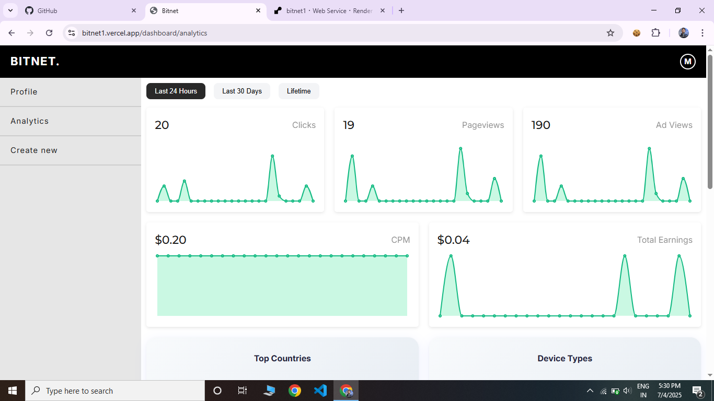

# 🚀 BitNet – Smart Ad-Based Link Shortener
## all the actual code is private !
> 📦 An advanced, production-ready Node.js + Express app to create, share, and monetize short URLs with integrated ad pages and real-time analytics.

 <!-- Optional: Add a real screenshot -->

---

## ✨ Features

- 🔗 **Shorten URLs** with unique short IDs
- 📊 **Real-time analytics**: ad views, countries, devices, and IP data
- 🪙 **Ad monetization flow**: require visitors to view a configurable number of ad pages before redirect
- 🧠 **Fraud protection**: block repeated clicks from same user/device in 24 hours
- 🌍 **Geo tracking**: capture country from IP using geoip-lite
- 📱 **Device detection**: desktop / mobile / tablet using UAParser
- 🔒 **Session-based flow**: protect ad page navigation
- ⚙️ **Modern stack**: Node.js, Express, PostgreSQL, EJS templating
- 🐳 **Ready for deployment**: works seamlessly on Render, Railway, or your own VPS

---

## 🛠 Tech Stack

| Layer          | Tech / Library                                      |
| -------------- | -------------------------------------------------- |
| Backend        | Node.js, Express                                   |
| Database       | PostgreSQL                                         |
| ORM / DB       | node-postgres (`pg`)                               |
| Device Detect  | [ua-parser-js](https://github.com/faisalman/ua-parser-js) |
| GeoIP Lookup   | [geoip-lite](https://github.com/bluesmoon/node-geoip) |
| Session        | express-session + memory store (or Redis)          |
| View Engine    | EJS                                                |

---

## ✏️ How it works
User visits short link /abc123.

Server loads original URL and required ad pages.

Initializes a session flow and redirects to first ad page.

Each ad page logs the visit, increments page counter, and validates user can't skip.

On last page, redirects to the original URL.

🔒 Click Fraud Protection
Unique ip_ua_hash (IP + User-Agent) per user

Limit: configurable number of clicks per 24h window (default: 2)

Repeated requests or parallel requests are ignored (session _locked flag)

--

## 📊 Analytics
For each click:

Link UUID

Country (via geoip)

Device type (mobile / tablet / desktop)

Number of ad views

Timestamp

You can easily extend this to build a dashboard.

--

## 📊 ADMIN DASHBOARD

total clicks

total pageviews

total adviews

avrage CPM

total Earnings

Device types

Geo Locations

---

## ✨ Author
Built with ❤️ by Mahesh4net

